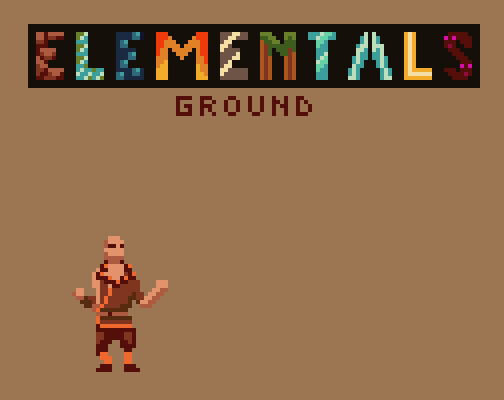

# SacredForest

Fast paced 2D retro action platformer, inspired by Katana Zero and metroidvania combat.

You'd embark on a journey to save the Sacred Forest, a magical forest in which different creatures live but now attacked by the Selinam kingdom to steal the powers of these creatures stealing also its peace. Help the forest to rescue their leaders and get stronger with their help!

### [Consider playing it in itch.io - Sacred Forest](https://salmonsimon.itch.io/sacred-forest)

## Main Menu

On the main menu you get three main options, **Play**, **Settings** and **Quit**. 

On the **Play** option you can store up to three saved games, delete those saved games and start new ones. You can choose between three difficulty levels: *Normal* where you would die with one hit, and kill with one hit; *Easy* where you would die with two hits and *Baby* where you would die with three hits.

On **Settings** you have the option to control the volume of music and sound effects.

Finally, on **Quit** you'll quit the application, leaving the game.

<picture>

</picture>

## Main Scene

<picture>

</picture>

The main scene is a rest area, from which you'll enter all different levels of the game. Here you'll see most of the cinematics explaining the context of the game and NPC's would guide you through the different levels you'd need to pass.

As of now, for the first release of this demo, there is only one level or "Fighting Route" available, which you enter through a portal.

<picture>

</picture>

## Fighting Mechanics Scene

In this scene, the player will learn about how to control the main character, as well as different mechanics for the game. For example, you'll learn that you can break arrows, jump different heights and also the immunity of enemies with more than one health point.

<picture>

</picture>

## First Fighting Route Scene

First level of the game, it's made out of seven frames, which are loaded individually to improve performance and order. Each frame contains its own cinemachine virtual camera, camera constraints, grid, decoration container, platform container, frame limits, frame change trigger and enemy spawners. Frames can be restarted when the player dies, without need to reload the scene, thus making the game feel faster and more immersive. All frames are created with them difficulties in mind, so the learning curves adapts while clearing them.

#### First Frame

<picture>

</picture>

#### Second Frame

<picture>

</picture>

#### Third Frame

<picture>

</picture>

#### Fourth Frame - Mini Boss

<picture>

</picture>

On this frame, the first mini boss is introduced, showing enemies which can have more than one health point. Also, it starts with a cutscene and dialogue where the enemy introduces himself.

#### Fifth Frame

<picture>

</picture>

#### Sixth Frame - Boss Room

<picture>

</picture>

The boss for the first level is a ground monk, called ***Grim Bearer***, which has the ability to transform into a ground elemental, making this first boss encounter perfect for the player to get used to the controls.

<picture>

</picture>

<picture>

</picture>

#### Seventh Frame - Exit

<picture>

</picture>

After defeating the boss, you'll rescue the kidnapped animal, ***The Sly***, which then as a reward will grant you the *Dash* ability, which allow you to travel distances faster without taking any damage.

## Foxes Home Scene

After clearing the first level, you'll be able to see the house of ***The Sly***, where he and other foxes live. From there, you can chat with him and also try clearing the first level again.

<picture>

</picture>

## Dialogue System

As for the dialogue system used, it was made in house. There are two types of dialogues, ***Bubble Dialogues***, which will be the ones used by NPC's or enemies. The second type are ***Screen Overlay Dialogues***, used for signs or when enemies are not well centered in camera.

#### Bubble Dialogues

<picture>

</picture>

***Note:** there are two background colors for bubble dialogues, white used for friendly NPC's and black when used for enemies.* 

#### Screen Overlay Dialogues

<picture>

</picture>

## Other Details

- Walking make different step sounds depending on the type of ground stepped. 
- Many cutscenes to liven up the game.
- Cinematic brackets used in cutscenes, to give it a more cinematic look.
- Blood is instantiated when hit, choosing 3 out of 9 different blood animations, to create unique blood patterns each time.
- Different hit sounds depending on the type of weapon used, now supporting Default, Bludgeoning, Sword and Fire (magic).
- Over 60 randomized death phrases to (DIS)<del>EN</del>courage players.
- Counters kills, deaths and time played.
- Saved games on main menu show counters as well as difficulty level chosen.
- Restart frame button in pause menu.
- Enemies have an alert system, to alert enemies close enough when the player is seen.
- Dust particles used on jumps and landings, as well as when breaking arrows.
- Breakable objects (signs and barrels)
- Beautiful Parallax backgrounds

## Assets used

[Consider playing it in itch.io - Museum Thief](https://salmonsimon.itch.io/museum-thief)

- MC animations: [Clembod](https://clembod.itch.io/)

- MC Voice: [Cici Fyre](https://cicifyre.itch.io/)

- Normal enemies: [Sven Thole](https://sventhole.itch.io/) & [Luiz Melo](https://luizmelo.itch.io/)

- Ground Monk Boss: [Chierit](https://chierit.itch.io/)

- Main Parallax Background & Animated Fox NPC's: [Ansimuz](https://ansimuz.itch.io/)

- Tileset and First Level Parallax Backgrounds: [Brullov Studios](https://brullov.itch.io/)

- Foxes sprites: [Elthen Pixel Art Shop](https://elthen.itch.io/)

- Music: [Abstraction](http://www.abstractionmusic.com/) & [Comigo](https://comigo.itch.io/)

- Male enemy voices: [John Carroll](https://johncarroll.itch.io/)
